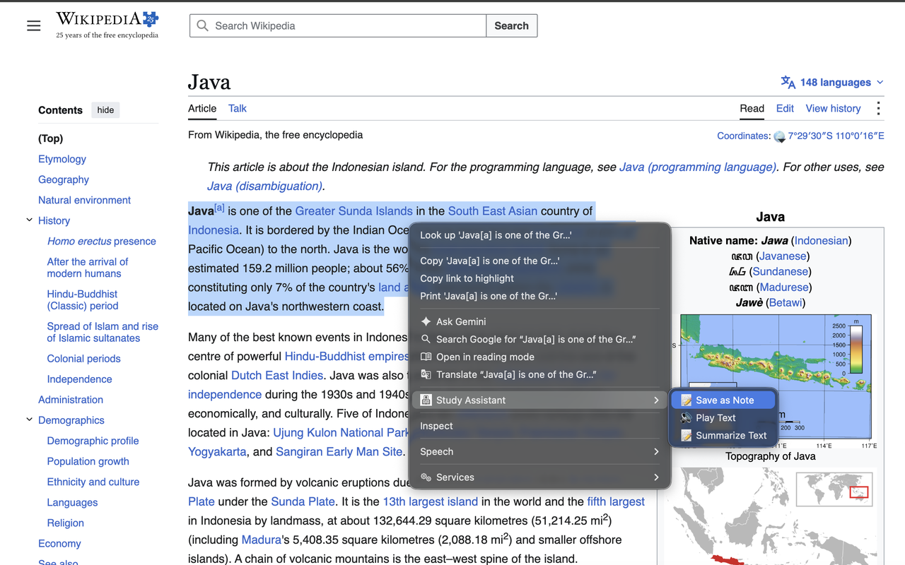
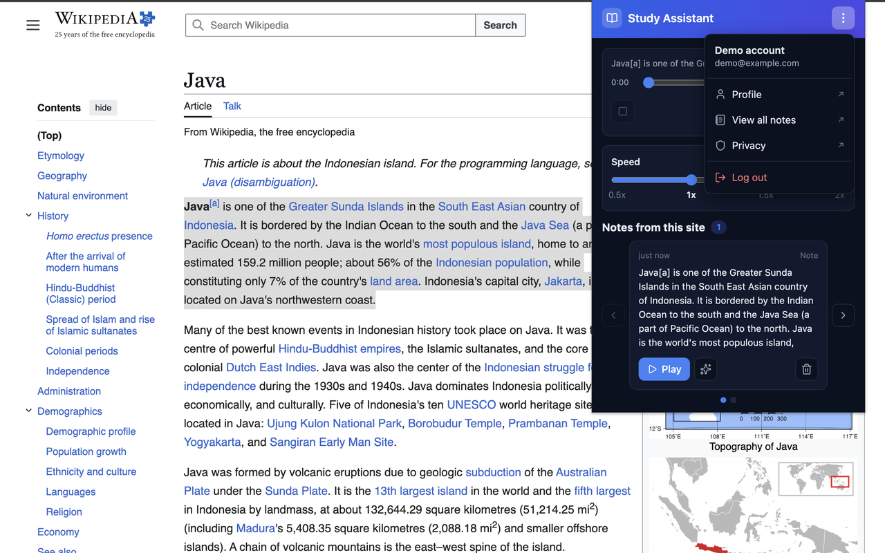
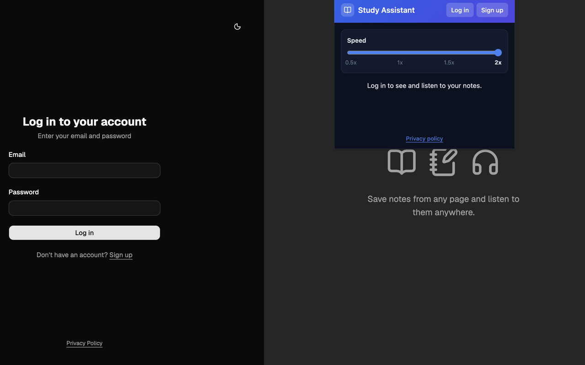
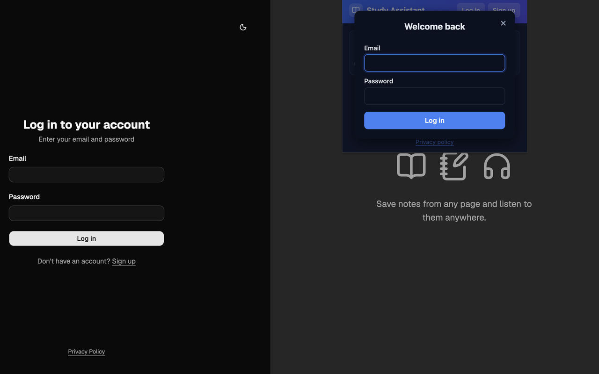

# TTS Study Assistant

A productivity tool for saving, organizing, and listening to notes from any website: a Chrome extension for quick capture and playback, a web dashboard, and a Go API.

## Screenshots


| | |
| --- | --- |
|  |  |
| **Right-click** a selection to save it, play it or summarize it | **Account menu**: dashboard links and log out |
|  |  |
| **Before logging in**: speed control and a prompt to log in | **Log in** straight from the popup |

## Monorepo structure

- `backend/` — Go/Fiber REST API: JWT auth, notes, AI summaries, user management
- `frontend/` — React + Vite + shadcn/ui web dashboard
- `extension/` — Chrome extension for saving and listening to notes from any site
- `docs/screenshots/` — README and Chrome Web Store screenshots (1280×800)

## Quick start

1. **Clone the repo:**
   ```sh
   git clone https://github.com/pratts/tts-study-assistant.git
   cd tts-study-assistant
   ```

2. **See the individual READMEs for setup:**
   - [Backend](./backend/README.md)
   - [Frontend](./frontend/README.md)
   - [Extension](./extension/README.md), including how to release it

## Features

- Save text from any page as a note: floating button, right-click menu, or Alt+S
- Text-to-speech playback with pause/resume, a progress bar and four speeds
- AI summaries of notes, with a toggle between the note and its summary
- Notes grouped by site, plus a web dashboard to browse, edit and delete them
- Secure authentication (bcrypt passwords, JWT sessions)

---

MIT License
